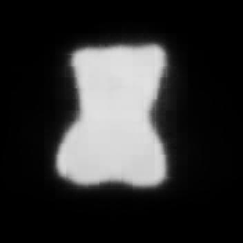
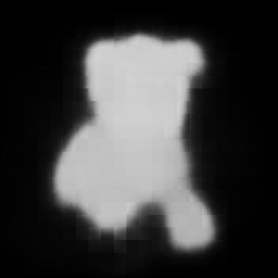
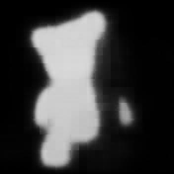
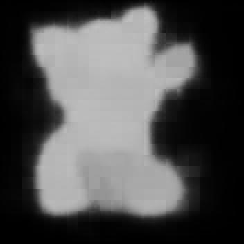

# CLIP-Masking

 |  | |  |
---| ---| ---| ---|  

 |  |  | 
---| ---| ---| ---|

## Setting
### Weights

- ```wget https://owncloud.gwdg.de/index.php/s/ioHbRzFx6th32hn/download -O ./clipseg/weights.zip```
- ```unzip -d ./clipseg/weights -j ./clipseg/weights.zip```

### Install

- ```pip install -r requirements.txt```

## Generate

- ```python main.py --image_dir ./data/teddy --super_class teddy```

## Structure

```
./
├── clipseg
│  ├── models
│  ├── weigts
│  └── weights.zip
├── data
│   └── teddy
│       ├── mask(outputs)
│       │   ├── 0.jpg
│       │   ├── ...
│       │   └── x.jpg
│       ├── 0.jpg
│       ├── ...
│       └── x.jpg
├── dataset.py
├── main.py
├── README.md
└── requirements.txt
```
